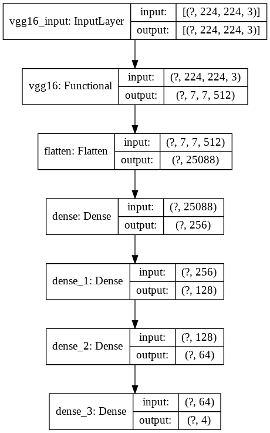

# License-Plate-Localization

Pretrained VGG16 model with imagenet weights then added dense layers and l2 regularization to deal with high variation that was found

DATASET used : https://www.kaggle.com/dataturks/vehicle-number-plate-detection

localization_using_vgg16.ipynb : run file to view outcome of model

Indian_Number_plates.json : Dataset downloaded from link above

Model used : 

Model Loss : 

Model Accuracy : 

Results on Test Set

Conclusion : 

Model is good with localization but dataset cannot be used for prediction due to low quality of images and accuracy can still be increased with larger dataset 
